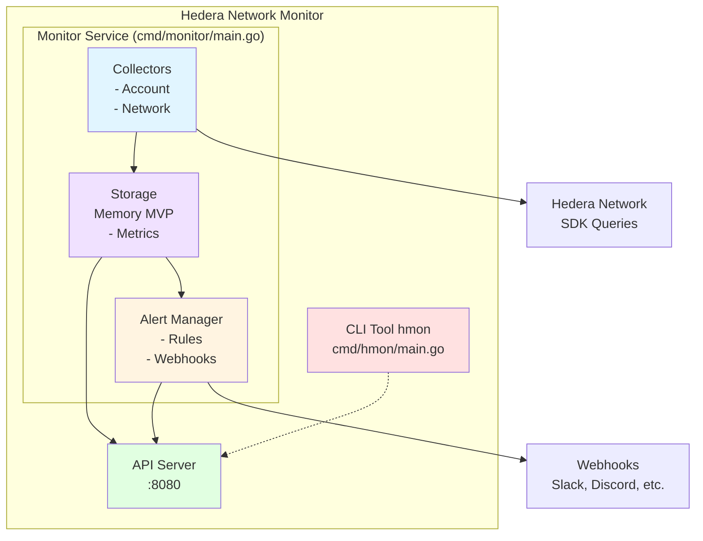

# Hedera Network Monitor

A comprehensive Go-based monitoring and alerting tool for the Hedera blockchain network. Monitor account balances, transactions, and network health with real-time alerts and a REST API.

## Video Walkthrough

Watch a brief explanation of the project: [Loom Video](https://www.loom.com/share/dc83480fba0f4a7ca9dce4094ac6ed75)

## Table of Contents

- [Features](#features)
- [Architecture](#architecture)
- [Installation](#installation)
- [Configuration](#configuration)
- [Usage](#usage)
  - [Running the Service](#running-the-service)
  - [Using the CLI](#using-the-cli)
- [API Documentation](#api-documentation)
- [Examples](#examples)
- [Project Structure](#project-structure)
- [Development](#development)
- [Contributing](#contributing)
- [License](#license)

## Features

### Current Features (MVP)
- ✅ Monitor multiple Hedera accounts for balance changes
- ✅ Track network status and node availability
- ✅ Collect and store metrics in-memory (for MVP)
- ✅ Alert via webhooks when conditions are met
- ✅ REST API for querying metrics
- ✅ Command-line interface for one-off queries

### Planned Features
- 📋 Multiple storage backends (PostgreSQL, InfluxDB, Prometheus)
- 📋 Prometheus metrics export for Grafana integration
- 📋 Web UI dashboard
- 📋 Transaction history tracking and analysis
- 📋 Custom alerting rule engine with DSL
- 📋 Rate limiting and cost analysis
- 📋 Historical data export (CSV, JSON)
- 📋 Real-time WebSocket API for metrics
- 📋 Alert rule templates and marketplace
- 📋 Multi-network monitoring (mainnet + testnet)

## Architecture



### Component Overview

**Monitor Service (Daemon)**
- Long-running background service
- Manages collectors, alert manager, and storage
- Provides REST API for metric queries
- Graceful shutdown via signal handling

**Collectors**
- Run concurrently, gathering metrics from Hedera
- Account collector: monitors balances and transactions
- Network collector: monitors node availability and status
- Extensible design for custom collectors

**Alert Manager**
- Evaluates metrics against configured rules
- Manages alert cooldowns to prevent alert spam
- Sends notifications via webhooks
- Support for multiple severity levels

**Storage**
- Interface-based design for pluggable backends
- In-memory storage for MVP (10k metrics)
- Future support: PostgreSQL, InfluxDB, Prometheus

**CLI Tool**
- One-off queries to Hedera network
- Query historical data from service API
- Manage alert rules
- Human-friendly output formatting

## Installation

### Prerequisites

- Go 1.21 or later
- Git
- Hedera testnet or mainnet access

### Build from Source

```bash
# Clone the repository
git clone https://github.com/kaldun-tech/hedera-network-monitor.git
cd hedera-network-monitor

# Download dependencies
go mod download

# Build the monitor service
go build -o monitor ./cmd/monitor

# Build the CLI tool
go build -o hmon ./cmd/hmon
```

### Using Make

```bash
# Build everything
make build

# Build specific targets
make build-monitor    # Build monitor service only
make build-cli        # Build CLI tool only

# Run tests
make test

# Run linter
make lint

# Clean build artifacts
make clean
```

## Configuration

### Setup Steps

1. **Copy example configuration:**
   ```bash
   cp config/config.example.yaml config/config.yaml
   ```

2. **Edit configuration with your settings:**
   ```bash
   nano config/config.yaml
   ```

3. **Key configuration items:**
   - `network.name`: "mainnet" or "testnet"
   - `network.operator_id`: Your operator account ID (e.g., "0.0.1234")
   - `network.operator_key`: Your operator private key
   - `accounts`: List of accounts to monitor
   - `api.port`: API server port (default: 8080)
   - `alerting.webhooks`: Webhook URLs for alerts

### Configuration File Structure

See `config/config.example.yaml` for a complete example with inline documentation.

Key sections:
- **network**: Hedera network connection settings
- **accounts**: List of accounts to monitor
- **alerting**: Alert rules and webhook configuration
- **api**: REST API server settings
- **logging**: Logging level and format

## Usage

### Running the Service

```bash
# Start the monitor service with default config
./monitor

# Run with custom config file
./monitor --config /path/to/config.yaml

# Run in verbose mode
./monitor --loglevel debug
```

The service will:
1. Load configuration
2. Initialize collectors
3. Start the API server (default: http://localhost:8080)
4. Begin collecting metrics
5. Monitor metrics against alert rules
6. Send webhooks for triggered alerts

**Graceful Shutdown:**
```bash
# Send SIGTERM or SIGINT (Ctrl+C) to gracefully shutdown
# Service will:
# - Stop accepting new requests
# - Wait for in-flight operations to complete
# - Persist any critical state
# - Close connections cleanly
```

### Using the CLI

The `hmon` CLI tool provides one-off queries and configuration:

```bash
# Get account balance
hmon account balance 0.0.5000

# Get account transactions
hmon account transactions 0.0.5000

# Get network status
hmon network status

# List alert rules
hmon alerts list

# Add a new alert rule
hmon alerts add "balance < 1000000000"

# Use custom API endpoint
hmon --api-url http://monitoring-server.example.com:8080 account balance 0.0.5000

# Set log level
hmon --loglevel debug network status
```

## API Documentation

### Health Check

```bash
GET /health

Response:
{
  "status": "healthy",
  "version": "0.1.0"
}
```

### Get Metrics

```bash
GET /api/v1/metrics?name=account_balance&limit=100

Query Parameters:
  name: Filter by metric name (optional)
  limit: Maximum results (default: 100)

Response:
{
  "metrics": [
    {
      "name": "account_balance",
      "timestamp": 1699564800,
      "value": 1000000000,
      "labels": {
        "account_id": "0.0.5000",
        "label": "Main Account"
      }
    }
  ],
  "count": 1
}
```

### Get Metrics by Account

```bash
GET /api/v1/metrics/account?key=account_id&value=0.0.5000

Query Parameters:
  key: Label key to filter by (e.g., "account_id")
  value: Label value to filter by (e.g., "0.0.5000")

Response:
{
  "metrics": [...],
  "count": 5
}
```

## Examples

### Monitor Account Balance

**Configuration (config.yaml):**
```yaml
accounts:
  - id: "0.0.5000"
    label: "Trading Account"

alerting:
  enabled: true
  webhooks:
    - "https://hooks.slack.com/services/..."
  rules:
    - id: "balance_low"
      name: "Low Balance Alert"
      metric_name: "account_balance"
      condition: "<"
      threshold: 1000000000  # 10 HBAR in tinybar
      severity: "warning"
```

**Run service:**
```bash
./monitor
```

**Query via CLI:**
```bash
hmon account balance 0.0.5000
```

**Query via API:**
```bash
curl http://localhost:8080/api/v1/metrics?name=account_balance&limit=10
```

### Multi-Account Monitoring

Monitor multiple accounts with different alert thresholds:

```yaml
accounts:
  - id: "0.0.5000"
    label: "Main Account"
  - id: "0.0.5001"
    label: "Reserve Account"
  - id: "0.0.5002"
    label: "Fee Account"

alerting:
  rules:
    - id: "main_balance_critical"
      name: "Main Account Critical"
      metric_name: "account_balance"
      condition: "<"
      threshold: 5000000000  # 50 HBAR
      severity: "critical"

    - id: "reserve_balance_warning"
      name: "Reserve Account Low"
      metric_name: "account_balance"
      condition: "<"
      threshold: 1000000000  # 10 HBAR
      severity: "warning"
```

### Network Health Monitoring

Monitor Hedera network availability:

```yaml
alerting:
  rules:
    - id: "network_nodes_down"
      name: "Network Degradation"
      metric_name: "network_nodes_available"
      condition: "<"
      threshold: 10
      severity: "critical"
```

## Project Structure

```
hedera-network-monitor/
├── cmd/
│   ├── monitor/
│   │   └── main.go              # Monitor service entry point
│   └── hmon/
│       └── main.go              # CLI tool entry point
├── internal/
│   ├── collector/
│   │   ├── collector.go         # Collector interface
│   │   ├── account.go           # Account collector
│   │   └── network.go           # Network collector
│   ├── alerting/
│   │   ├── manager.go           # Alert manager
│   │   ├── rules.go             # Alert rule definitions
│   │   ├── webhook.go           # Webhook sender
│   │   └── errors.go            # Error definitions
│   ├── storage/
│   │   ├── storage.go           # Storage interface
│   │   └── memory.go            # In-memory implementation
│   └── api/
│       ├── server.go            # HTTP server
│       └── handlers.go          # API handlers
├── pkg/
│   ├── hedera/
│   │   └── client.go            # Hedera SDK wrapper
│   ├── metrics/
│   │   └── metrics.go           # Metrics utilities
│   └── config/
│       └── config.go            # Configuration management
├── config.example.yaml          # Example configuration
├── go.mod                       # Go module definition
├── go.sum                       # Go module checksums
├── Makefile                     # Build and dev commands
├── README.md                    # This file
├── CLAUDE.md                    # Claude Code guidance
└── LICENSE                      # MIT License
```

## Development

### Setting Up Development Environment

```bash
# Install development tools
go install github.com/golangci/golangci-lint/cmd/golangci-lint@latest

# Format code
make fmt

# Run linter
make lint

# Run unit tests (fast, ~4s - run before committing)
make test-unit

# Run integration tests (slow, ~30-60s - run before pushing)
make test-integration

# Run all tests (unit + integration)
make test

# Run tests with coverage report
make test-coverage
```

### Test Organization

The test suite is split into two categories:

- **Unit Tests:** Fast, ~4 seconds. Run on every commit. Excludes long-running async tests.
  ```bash
  make test-unit
  ./scripts/check-offline.sh  # Also runs unit tests
  ```

- **Integration Tests:** Slow, ~30-60 seconds. Test end-to-end workflows with async operations.
  ```bash
  make test-integration
  ```

### Test Coverage

**Currently Implemented:**
- ✅ Alert condition operators (41 tests)
- ✅ Alert manager core functionality (16 tests)
- ✅ Webhook retry logic with exponential backoff (11 tests)
- ✅ Integration tests for alert dispatch and webhook handling (10 tests)
- ✅ CLI alert commands (list, add, integration workflows) (13 tests)
- ✅ Storage, configuration, and Hedera SDK wrapper tests
- ✅ **Phase 4 Complete:** All planned test phases fully implemented

**Test Statistics:**
- **Total:** 100+ unit tests + 10 integration tests
- **Unit Test Speed:** ~4 seconds (fast feedback on commits)
- **Integration Test Speed:** ~30-60 seconds (comprehensive validation before push)
- **Linter Status:** Zero warnings

**Known Limitations:**
- Account balance/transaction CLI commands are deferred (require Hedera SDK mocking). These can be tested via integration tests with the full service running, or implemented in a future phase when dependency injection is added to those commands.

### Development Workflow

1. **Create a feature branch:**
   ```bash
   git checkout -b feature/your-feature
   ```

2. **Make changes and test (fast path - run often):**
   ```bash
   ./scripts/check-offline.sh  # Format, lint, unit tests, build (~10-20s)
   ```

3. **Before pushing, run full verification:**
   ```bash
   # Terminal 1: Start the monitor
   ./monitor --config config/config.yaml

   # Terminal 2: Run online checks
   ./scripts/check-online.sh  # Full integration verification (~30-60s)
   ```

4. **Commit and push:**
   ```bash
   git add .
   git commit -m "Your feature description"
   git push origin feature/your-feature
   ```

See [Pre-Push Verification](#pre-push-verification) for detailed testing instructions.

### Common Development Tasks

**Add a new collector:**
1. Create `internal/collector/your_collector.go`
2. Implement the `Collector` interface
3. Register in `cmd/monitor/main.go`

**Add API endpoint:**
1. Add handler in `internal/api/server.go` or `handlers.go`
2. Register route in `NewServer()`
3. Document in API Documentation section

**Add configuration option:**
1. Update `Config` struct in `pkg/config/config.go`
2. Add to `config.example.yaml` with documentation
3. Load in configuration parsing logic

### Testing Alert System with Real Metrics

The `testgen` tool generates Hedera transactions to test the alert system with real metric flows:

**Build the test generator:**
```bash
go build -o testgen ./cmd/testgen
```

**Generate test transactions:**
```bash
# Basic usage (sends 5 transactions with 5 second intervals)
./testgen --config config/config.yaml

# Custom parameters
./testgen \
  --config config/config.yaml \
  --from 0.0.5000 \
  --to 0.0.5001 \
  --count 10 \
  --interval 3 \
  --amount 500000

# Flags:
#   -config string      Path to config file (default: config/config.yaml)
#   -from string         Account to send from (default: first monitored account)
#   -to string           Account to send to (default: second monitored account)
#   -count int           Number of transactions (default: 5)
#   -interval int        Seconds between transactions (default: 5)
#   -amount int64        Amount in tinybar (default: 1000000, ~0.01 HBAR)
#   -network string      Override network (mainnet/testnet)
```

**Complete alert testing workflow:**
1. Start the monitor service: `./monitor --config config/config.yaml`
2. In another terminal, run testgen: `./testgen --config config/config.yaml`
   - testgen sends from your operator account TO your monitored accounts
   - This generates activity on the monitored accounts (which are what the alerts watch)
3. Watch monitor logs for metric collection and alert evaluation
4. Query metrics with CLI: `./hmon account balance 0.0.5000`
5. Check alert rules firing: `./hmon alerts list`

**Important:** testgen transfers FROM your operator account (you have the private key) TO your monitored accounts. You don't need private keys for the monitored accounts.

**Testing specific alerts:**
- **Low Balance Alert**: Run testgen to send HBAR TO an account; balance changes trigger evaluation
- **High Transaction Rate**: Run testgen with `-count 20 -interval 2` to send many transactions quickly
- **No Recent Transactions**: Run testgen, then wait without sending more transactions
- **Network Unavailable**: Depends on testnet state (hard to trigger manually)

### Pre-Push Verification

Before pushing changes, run the full test suite to ensure everything works end-to-end:

**Fast checks (run on every commit):**
```bash
./scripts/check-offline.sh
# Runs: format, lint, unit tests, build
# Time: ~10-20 seconds
```

**Full verification (run before pushing):**
```bash
# In one terminal, start the monitor service
./monitor --config config/config.yaml

# In another terminal, run online checks
./scripts/check-online.sh
# Verifies: API health, metrics collection, alert rules, CLI functionality
# Time: ~30-60 seconds
```

For details on the test infrastructure, see [`scripts/README.md`](scripts/README.md).

## Contributing

We welcome contributions! Please:

1. Fork the repository
2. Create a feature branch (`git checkout -b feature/amazing-feature`)
3. Make your changes
4. Run tests and linter (`make test && make lint`)
5. Commit with clear messages
6. Push to your fork
7. Open a Pull Request

Please ensure:
- Code follows Go conventions and best practices
- All tests pass
- New features include tests
- Documentation is updated
- No hardcoded secrets or credentials

## Roadmap

### Phase 1 (MVP - Current)
- [x] Basic account monitoring
- [x] Network status collection
- [x] Alert rules with webhooks
- [x] REST API
- [x] CLI tool
- [ ] Complete TODO items in code

### Phase 2 (Enhancement)
- [ ] PostgreSQL storage backend
- [ ] Prometheus metrics export
- [ ] Advanced alerting DSL
- [ ] Transaction history tracking
- [ ] Cost analysis

### Phase 3 (Web & Dashboard)
- [ ] Web UI dashboard
- [ ] Real-time WebSocket API
- [ ] User authentication
- [ ] Multi-user support

### Phase 4 (Enterprise)
- [ ] InfluxDB storage
- [ ] Kubernetes deployment
- [ ] High availability setup
- [ ] Enterprise alerting integrations

## Troubleshooting

### Service won't start

**Error: "Failed to load configuration"**
```bash
# Ensure config file exists
cp config.example.yaml config.yaml
# Edit with your credentials
nano config.yaml
```

**Error: "connection refused"**
```bash
# Check if Hedera network is accessible
# Verify network settings in config.yaml
# Check firewall/network connectivity
```

### Alerts not triggering

- Verify webhooks are correct and accessible
- Check alert rules are enabled in configuration
- Review logs for alert evaluation errors
- Ensure metrics are being collected (check `/api/v1/metrics`)

### CLI tool not working

```bash
# Verify service is running
curl http://localhost:8080/health

# Check API URL
hmon --api-url http://localhost:8080 account balance 0.0.5000
```

## License

This project is licensed under the MIT License - see the [LICENSE](LICENSE) file for details.

## Support

For issues, questions, or suggestions:
- Open an issue on GitHub
- Check existing documentation
- Review code comments marked with `TODO`

## Acknowledgments

- [Hedera SDK Go](https://github.com/hashgraph/hedera-sdk-go)
- [Cobra](https://github.com/spf13/cobra) - CLI framework
- [Viper](https://github.com/spf13/viper) - Configuration management
